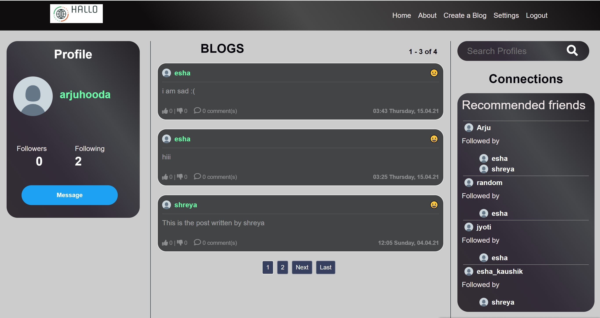

# Hallo-Web-App-Using-Django
It is a Django Based Social Networking Website like twitter.

### Home Page 


## Setup

1. Git Clone the project with: ```git clone https://github.com/arjuhooda/Hallo-Web-App-Using-Django.git```.

2. Move to the base directory: ```cd Hallo-Web-App-Using-Django```

3. Create a new python enveronment with: ```python -m venv env```.

4. Activate enveronment with: ```env\Scripts\activate``` on windows, or ```source env/bin/activate``` on Mac and Linux.

5. Install required dependences with: ```pip install -r requirements.txt```.

6. Make migrations with: ```python manage.py makemigrations``` and then ```python manage.py migrate```.

7. Run app localy with: ```python manage.py runserver```.


## Features

1. This system provides users to register their profile.
2. This system provides users to send a message, images, and data files publicly to their friends. 
3. Users can maintain the scrap book whatever scraps he has sent to users.
4. The system provides users to grow their network by recommending them to their nearest friend based on their mutual connections.
5. This system provides users to create blogs which can be seen by their followers.
6. This system provides users to like, dislike, comment on their friends' blogs.
7. This system provides the admin to differentiate between the good and bad users based on the sentiment of their blog posts.
8. This system helps user to search for a profile by their typing their username’s keyword.


